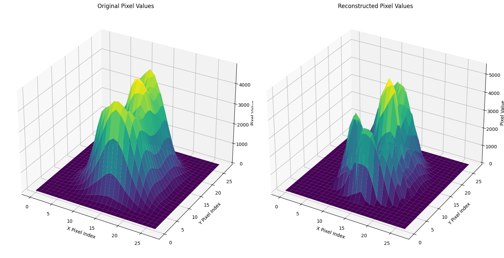

# MADE (Masked Autoencoder for Distribution Estimation)

## Introduction
MADE is an autoregressive model designed for density estimation. It uses masking to ensure the autoregressive property, allowing for efficient training and inference.

## Architecture

MADE modifies a standard feedforward neural network by applying masks to its weights to enforce autoregressive constraints.

## Results

The previous figure shows the estimated distribution by the trained MADE model compared with the original one, demonstrating its ability to capture complex distributions.
